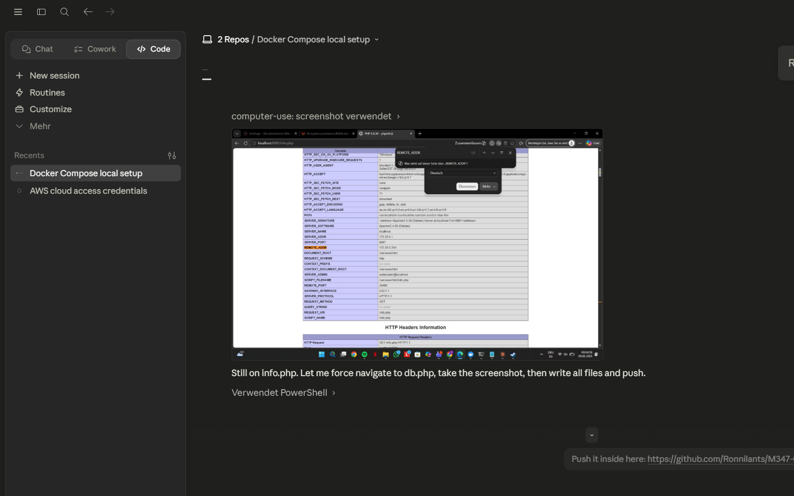
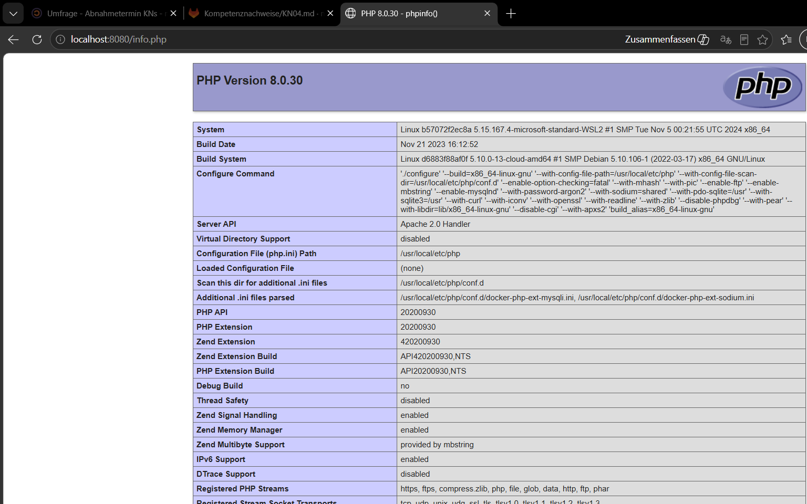
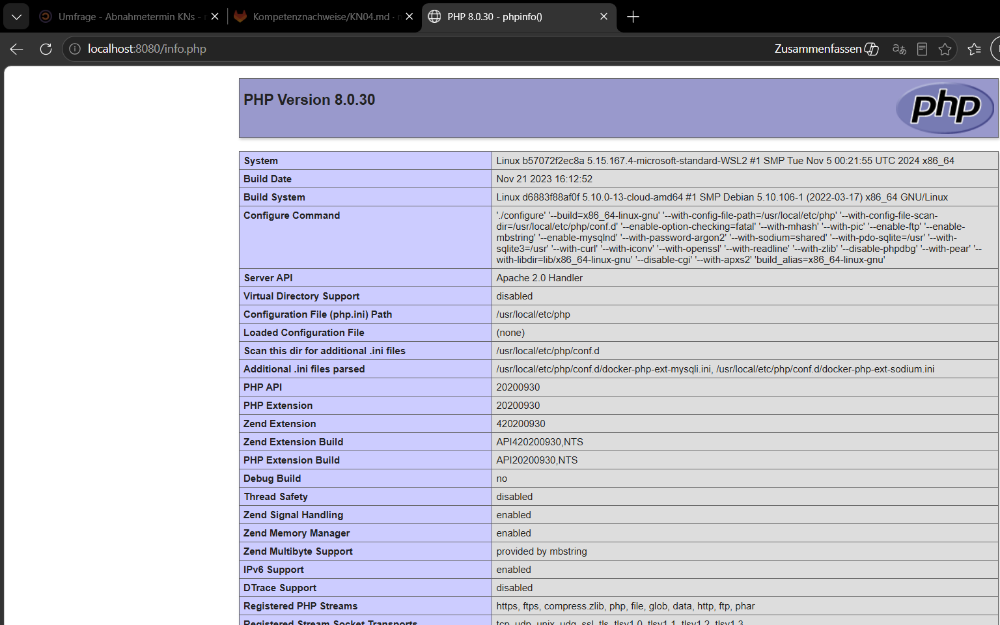

# KN04: Docker Compose

## Inhaltsverzeichnis
- [A) Docker Compose Lokal](#a-docker-compose-lokal)
  - [Teil a) Original Images](#teil-a-verwendung-von-original-images)
  - [Teil b) Eigene Images](#teil-b-verwendung-eigener-images)
- [B) Docker Compose Cloud](#b-docker-compose-cloud)

---

# A) Docker Compose Lokal

## Teil a) Verwendung von Original Images

### Docker Compose File (`KN04/teil-a/docker-compose.yml`)

```yaml
services:
  db:
    image: mariadb:latest
    container_name: m347-kn04a-db
    environment:
      MYSQL_ROOT_PASSWORD: rootpassword
      MYSQL_DATABASE: mysql
      MYSQL_USER: admin
      MYSQL_PASSWORD: adminpassword
    networks:
      kn04-network:

  web:
    build: .
    container_name: m347-kn04a-web
    ports:
      - "8080:80"
    depends_on:
      - db
    networks:
      kn04-network:

networks:
  kn04-network:
    driver: bridge
    ipam:
      config:
        - subnet: 172.10.0.0/16
          ip_range: 172.10.5.0/24
          gateway: 172.10.5.254
```

### Dockerfile für Webserver (`KN04/teil-a/Dockerfile`)

```dockerfile
FROM php:8.0-apache

WORKDIR /var/www/html

COPY info.php .
COPY db.php .

RUN docker-php-ext-install mysqli

EXPOSE 80
```

### Was macht `docker compose up`?

`docker compose up` ist eine Zusammenfassung mehrerer Befehle:

| Schritt | Befehl (intern) | Erklärung |
|---------|-----------------|-----------|
| 1 | `docker network create` | Erstellt alle in der YAML-Datei definierten Netzwerke (hier: `kn04-network` mit dem definierten Subnet/IP-Range/Gateway) |
| 2 | `docker pull` | Lädt alle Images, die nicht lokal vorhanden sind, von Docker Hub herunter (hier: `mariadb:latest`) |
| 3 | `docker build` | Baut Images, die über `build:` definiert sind, aus einem Dockerfile (hier: das Web-Image aus `KN04/teil-a/Dockerfile`) |
| 4 | `docker create` | Erstellt die Container mit den definierten Konfigurationen (Namen, Ports, Umgebungsvariablen) |
| 5 | `docker start` | Startet die Container in der richtigen Reihenfolge (laut `depends_on`): zuerst `db`, dann `web` |

Mit dem Flag `-d` (detached) laufen die Container im Hintergrund.

---

### Screenshot 1 – info.php (Teil a) mit SERVER_ADDR und REMOTE_ADDR

Die Seite `http://localhost:8080/info.php` zeigt:
- **SERVER_ADDR: 172.10.5.1** – IP des Webserver-Containers im Docker-Netzwerk
- **REMOTE_ADDR: 172.10.5.254** – IP des Gateways (der Host greift über das Gateway zu)



---

### Screenshot 2 – db.php (Teil a)

Die Seite `http://localhost:8080/db.php` zeigt **"Verbindung erfolgreich!"**, weil beide Container im selben Docker-Netzwerk `kn04-network` sind und der Webserver den DB-Container über den Hostnamen `m347-kn04a-db` (Docker DNS) erreicht.



---

## Teil b) Verwendung Eigener Images

### Docker Compose File (`KN04/teil-b/docker-compose.yml`)

```yaml
services:
  db:
    image: mariadb:latest
    container_name: m347-kn04b-db
    environment:
      MYSQL_ROOT_PASSWORD: rootpassword
      MYSQL_DATABASE: mysql
      MYSQL_USER: admin
      MYSQL_PASSWORD: adminpassword
    networks:
      kn04b-network:

  web:
    image: ronnilants/kn02:kn02b-web
    container_name: m347-kn04b-web
    ports:
      - "8081:80"
    depends_on:
      - db
    networks:
      kn04b-network:

networks:
  kn04b-network:
    driver: bridge
    ipam:
      config:
        - subnet: 172.20.0.0/16
          ip_range: 172.20.5.0/24
          gateway: 172.20.5.254
```

Änderungen gegenüber Teil a:
- `build: .` ersetzt durch `image: ronnilants/kn02:kn02b-web` (publiziertes Image von Docker Hub)
- Kein Dockerfile mehr nötig
- Anderer IP-Range: `172.20.0.0/16` statt `172.10.0.0/16`
- Port `8081` statt `8080`

---

### Screenshot 3 – info.php (Teil b) mit SERVER_ADDR und REMOTE_ADDR

Die Seite `http://localhost:8081/info.php` zeigt:
- **SERVER_ADDR: 172.20.5.1**
- **REMOTE_ADDR: 172.20.5.254**



---

### Screenshot 4 – db.php (Teil b) – Fehler

Die Seite `http://localhost:8081/db.php` zeigt einen **Verbindungsfehler**.


---

### Erklärung des Fehlers (Teil b)

**Warum tritt der Fehler auf?**

Das publizierte Image `ronnilants/kn02:kn02b-web` wurde in KN02 gebaut. In der damaligen `db.php` wurde die **IP-Adresse** des Datenbank-Containers **fest eingetragen** (`172.17.0.3`), da die beiden Container in KN02 noch nicht im selben benutzerdefinierten Netzwerk waren.

```php
// db.php im publizierten Image (aus KN02):
$connection = mysqli_connect("172.17.0.3", "root", "rootpassword", "mysql");
```

Im neuen Docker-Compose-Netzwerk (`172.20.0.0/16`) bekommt der MariaDB-Container eine andere IP (z.B. `172.20.5.1`). Die hartcodierte IP `172.17.0.3` existiert in diesem Netzwerk nicht → Verbindung schlägt fehl.

**Lösung:**

Den Hostnamen des Containers (`m347-kn04b-db`) statt einer IP-Adresse verwenden. Docker löst Container-Namen automatisch per DNS auf, solange beide Container im selben Netzwerk sind:

```php
// Korrekte db.php:
$connection = mysqli_connect("m347-kn04b-db", "root", "rootpassword", "mysql");
```

Danach muss ein neues Image gebaut und auf Docker Hub gepusht werden.

---

# B) Docker Compose Cloud

### Cloud-Init Datei (`KN04/cloud-init.yaml`)

Die Cloud-Init-Datei installiert Docker, schreibt die Docker-Compose-Datei und startet die Applikation automatisch beim ersten Boot.

```yaml
#cloud-config
users:
  - name: ubuntu
    sudo: ALL=(ALL) NOPASSWD:ALL
    groups: users, admin
    home: /home/ubuntu
    shell: /bin/bash
    ssh_authorized_keys:
      - ssh-rsa AAAAB3NzaC1yc2EAAAADAQABAAABgQC0bBpJIWXkZN8Q... ronnilants@student
      - ssh-rsa AAAAB3NzaC1yc2EAAAADAQABAAABgQDLehpD... lehrperson@tbz

ssh_pwauth: false
disable_root: false

package_update: true
package_upgrade: true

packages:
  - apt-transport-https
  - ca-certificates
  - curl
  - software-properties-common

write_files:
  - path: /home/ubuntu/docker-compose.yml
    content: |
      services:
        db:
          image: mariadb:latest
          container_name: m347-kn04-db
          environment:
            MYSQL_ROOT_PASSWORD: rootpassword
            MYSQL_DATABASE: mysql
            MYSQL_USER: admin
            MYSQL_PASSWORD: adminpassword
          networks:
            kn04-network:

        web:
          image: ronnilants/kn02:kn02b-web
          container_name: m347-kn04-web
          ports:
            - "80:80"
          depends_on:
            - db
          networks:
            kn04-network:

      networks:
        kn04-network:
          driver: bridge
          ipam:
            config:
              - subnet: 172.10.0.0/16
                ip_range: 172.10.5.0/24
                gateway: 172.10.5.254
    owner: ubuntu:ubuntu

runcmd:
  - curl -fsSL https://get.docker.com -o get-docker.sh
  - sh get-docker.sh
  - usermod -aG docker ubuntu
  - cd /home/ubuntu
  - docker compose up -d

final_message: "KN04 Docker Compose Cloud Setup abgeschlossen! Webserver laeuft auf Port 80."
```

**Erklärung der Bereiche:**

- `users`: Erstellt den Ubuntu-User mit SSH-Keys (eigener Schlüssel + Schlüssel der Lehrperson). Passwort-Login ist deaktiviert.
- `package_update / packages`: Aktualisiert das System und installiert Abhängigkeiten für Docker.
- `write_files`: Schreibt die `docker-compose.yml` direkt auf den Server – kein manuelles Kopieren nötig.
- `runcmd`: Führt beim ersten Boot folgende Schritte aus:
  1. Docker installieren (offizielles Installationsskript)
  2. User zur Docker-Gruppe hinzufügen
  3. `docker compose up -d` startet beide Container im Hintergrund
- `final_message`: Erscheint am Ende von `/var/log/cloud-init-output.log` wenn alles erfolgreich war.
