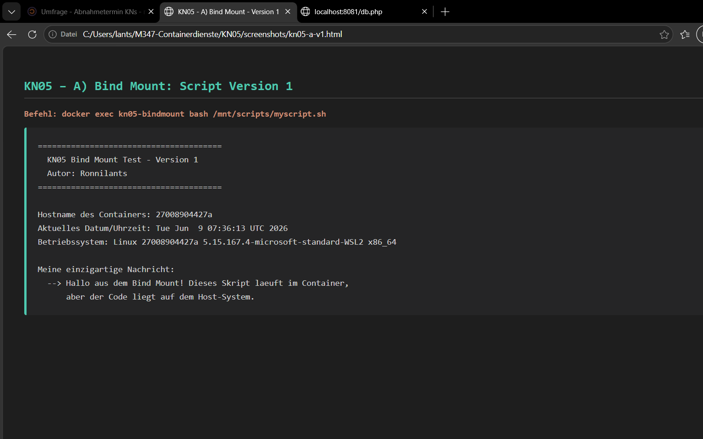
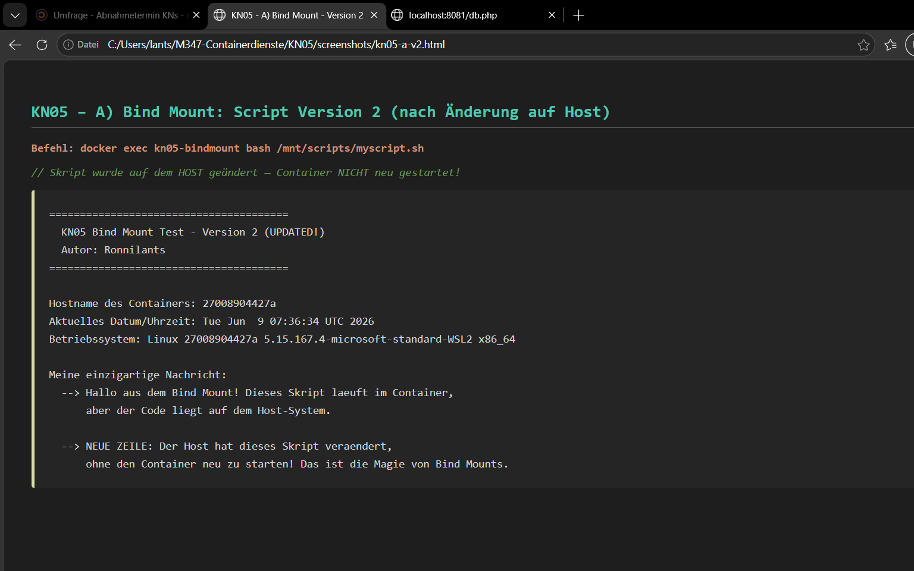
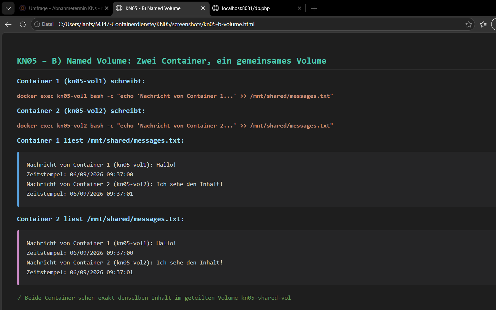
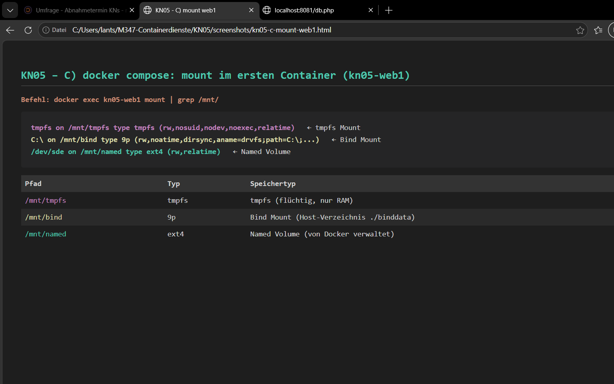
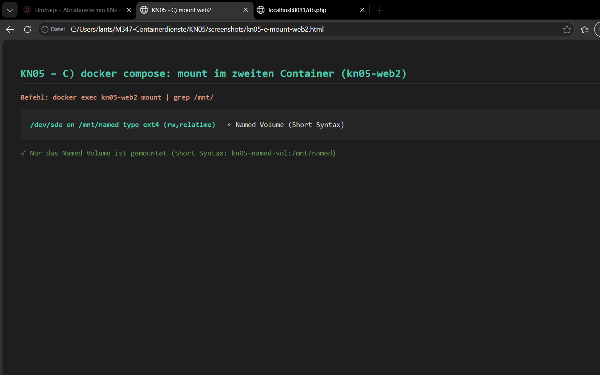

# KN05: Arbeit mit Speicher

## Inhaltsverzeichnis
- [A) Bind Mounts](#a-bind-mounts)
- [B) Volumes](#b-volumes)
- [C) Speicher mit Docker Compose](#c-speicher-mit-docker-compose)

---

# A) Bind Mounts

## Screencast: Bind Mount Demo

> **Screencast A:** [KN05/screencast-a.mp4](KN05/screencast-a.mp4)
>
> Das Video zeigt, wie ein Container mit einem Bind Mount gestartet wird, das Skript in Version 1 ausgeführt wird, die Datei auf dem Host bearbeitet wird, und dasselbe Skript in Version 2 im gleichen Container erneut ausgeführt wird — ohne Container-Neustart.

## Befehle zum Starten des Containers mit Bind Mount

```bash
# Container starten mit Bind Mount (-v HostPfad:ContainerPfad)
docker run -d --name kn05-demo-bindmount \
  -v C:\Users\lants\M347-Containerdienste\KN05\bind-mount:/mnt/scripts \
  nginx:latest

# Skript im Container ausführen
docker exec kn05-demo-bindmount bash /mnt/scripts/myscript.sh
```

## Bash-Skript Version 1 (`KN05/bind-mount/myscript.sh`)

```bash
#!/bin/bash
echo "======================================="
echo "  KN05 Bind Mount Test - Version 1"
echo "  Autor: Ronnilants"
echo "======================================="
echo ""
echo "Hostname des Containers: $(hostname)"
echo "Aktuelles Datum/Uhrzeit: $(date)"
echo "Betriebssystem: $(uname -a)"
echo ""
echo "Meine einzigartige Nachricht:"
echo "  --> Hallo aus dem Bind Mount! Dieses Skript laeuft im Container,"
echo "      aber der Code liegt auf dem Host-System."
```

## Ausgabe Version 1 (im Container ausgeführt)



```
=======================================
  KN05 Bind Mount Test - Version 1
  Autor: Ronnilants
=======================================

Hostname des Containers: 27008904427a
Aktuelles Datum/Uhrzeit: Tue Jun  9 07:36:13 UTC 2026
Betriebssystem: Linux 27008904427a 5.15.167.4-microsoft-standard-WSL2 ...

Meine einzigartige Nachricht:
  --> Hallo aus dem Bind Mount! Dieses Skript laeuft im Container,
      aber der Code liegt auf dem Host-System.
```

## Änderung des Skripts auf dem Host (Version 2)

Das Skript wurde auf dem **Host-System** geändert — der Container wurde **nicht neu gestartet**.

```bash
#!/bin/bash
echo "======================================="
echo "  KN05 Bind Mount Test - Version 2 (UPDATED!)"
echo "  Autor: Ronnilants"
echo "======================================="
echo ""
echo "Hostname des Containers: $(hostname)"
echo "Aktuelles Datum/Uhrzeit: $(date)"
echo "Betriebssystem: $(uname -a)"
echo ""
echo "Meine einzigartige Nachricht:"
echo "  --> Hallo aus dem Bind Mount! Dieses Skript laeuft im Container,"
echo "      aber der Code liegt auf dem Host-System."
echo ""
echo "  --> NEUE ZEILE: Der Host hat dieses Skript veraendert,"
echo "      ohne den Container neu zu starten! Das ist die Magie von Bind Mounts."
```

## Ausgabe Version 2 (nach Host-Änderung, gleicher Container)



```
=======================================
  KN05 Bind Mount Test - Version 2 (UPDATED!)
  Autor: Ronnilants
=======================================

Hostname des Containers: 27008904427a
Aktuelles Datum/Uhrzeit: Tue Jun  9 07:36:34 UTC 2026
Betriebssystem: Linux 27008904427a 5.15.167.4-microsoft-standard-WSL2 ...

Meine einzigartige Nachricht:
  --> Hallo aus dem Bind Mount! Dieses Skript laeuft im Container,
      aber der Code liegt auf dem Host-System.

  --> NEUE ZEILE: Der Host hat dieses Skript veraendert,
      ohne den Container neu zu starten! Das ist die Magie von Bind Mounts.
```

> **Erkenntnis:** Der Container hat die Änderung sofort gesehen, weil das Bind Mount das Host-Verzeichnis direkt einbindet. Kein Rebuild, kein Neustart nötig — ideal für Entwicklung.

---

# B) Volumes

## Screencast: Named Volume Demo

> **Screencast B:** [KN05/screencast-b.mp4](KN05/screencast-b.mp4)
>
> Das Video zeigt, wie ein Named Volume erstellt wird, zwei Container es einbinden, beide Container in dieselbe Datei schreiben und lesen, und das Volume nach dem Löschen der Container bestehen bleibt.

## Befehle zum Starten der Container mit Named Volume

```bash
# Named Volume erstellen
docker volume create kn05-shared-vol

# Zwei Container mit demselben Named Volume starten
docker run -d --name kn05-vol1 -v kn05-shared-vol:/mnt/shared nginx:latest
docker run -d --name kn05-vol2 -v kn05-shared-vol:/mnt/shared nginx:latest

# Container 1 schreibt in die geteilte Datei
docker exec kn05-vol1 bash -c "echo 'Nachricht von Container 1 (kn05-vol1): Hallo!' >> /mnt/shared/messages.txt"

# Container 2 schreibt in dieselbe Datei
docker exec kn05-vol2 bash -c "echo 'Nachricht von Container 2 (kn05-vol2): Ich sehe den Inhalt!' >> /mnt/shared/messages.txt"

# Container 1 liest die Datei
docker exec kn05-vol1 cat /mnt/shared/messages.txt

# Container 2 liest die Datei
docker exec kn05-vol2 cat /mnt/shared/messages.txt
```

## Screenshot: Beide Container lesen die geteilte Datei



## Ausgabe: Container 1 liest die Datei

```
Nachricht von Container 1 (kn05-vol1): Hallo!
Nachricht von Container 2 (kn05-vol2): Ich sehe den Inhalt!
```

## Ausgabe: Container 2 liest dieselbe Datei

```
Nachricht von Container 1 (kn05-vol1): Hallo!
Nachricht von Container 2 (kn05-vol2): Ich sehe den Inhalt!
```

> **Erkenntnis:** Beide Container sehen exakt denselben Inhalt, weil sie das gleiche Named Volume `kn05-shared-vol` mounten. Named Volumes werden von Docker verwaltet und bleiben erhalten, auch wenn Container gelöscht werden.

---

# C) Speicher mit Docker Compose

## Docker Compose Datei (`KN05/compose/docker-compose.yml`)

```yaml
services:
  web1:
    image: nginx:latest
    container_name: kn05-web1
    volumes:
      # Named Volume - Long Syntax
      - type: volume
        source: kn05-named-vol
        target: /mnt/named
      # Bind Mount - Long Syntax
      - type: bind
        source: ./binddata
        target: /mnt/bind
      # tmpfs Mount - Long Syntax
      - type: tmpfs
        target: /mnt/tmpfs

  web2:
    image: nginx:latest
    container_name: kn05-web2
    volumes:
      # Named Volume - Short Syntax
      - kn05-named-vol:/mnt/named

volumes:
  kn05-named-vol:
```

## Auszug `mount` im ersten Container (kn05-web1)



Zeigt alle **drei Speichertypen**:

```
tmpfs on /mnt/tmpfs type tmpfs (rw,nosuid,nodev,noexec,relatime)
C:\ on /mnt/bind type 9p (rw,noatime,dirsync,...)
/dev/sde on /mnt/named type ext4 (rw,relatime)
```

| Mount-Pfad    | Typ         | Beschreibung                              |
|---------------|-------------|-------------------------------------------|
| `/mnt/named`  | `ext4`      | Named Volume (von Docker verwaltet)       |
| `/mnt/bind`   | `9p`        | Bind Mount (Host-Verzeichnis `./binddata`)|
| `/mnt/tmpfs`  | `tmpfs`     | tmpfs (nur im RAM, flüchtig)              |

## Auszug `mount` im zweiten Container (kn05-web2)



Zeigt nur das **Named Volume**:

```
/dev/sde on /mnt/named type ext4 (rw,relatime)
```

| Mount-Pfad    | Typ         | Beschreibung                              |
|---------------|-------------|-------------------------------------------|
| `/mnt/named`  | `ext4`      | Named Volume (Short Syntax)               |
