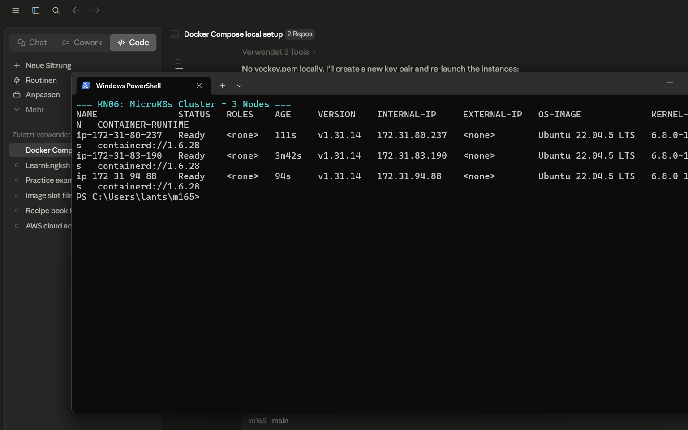
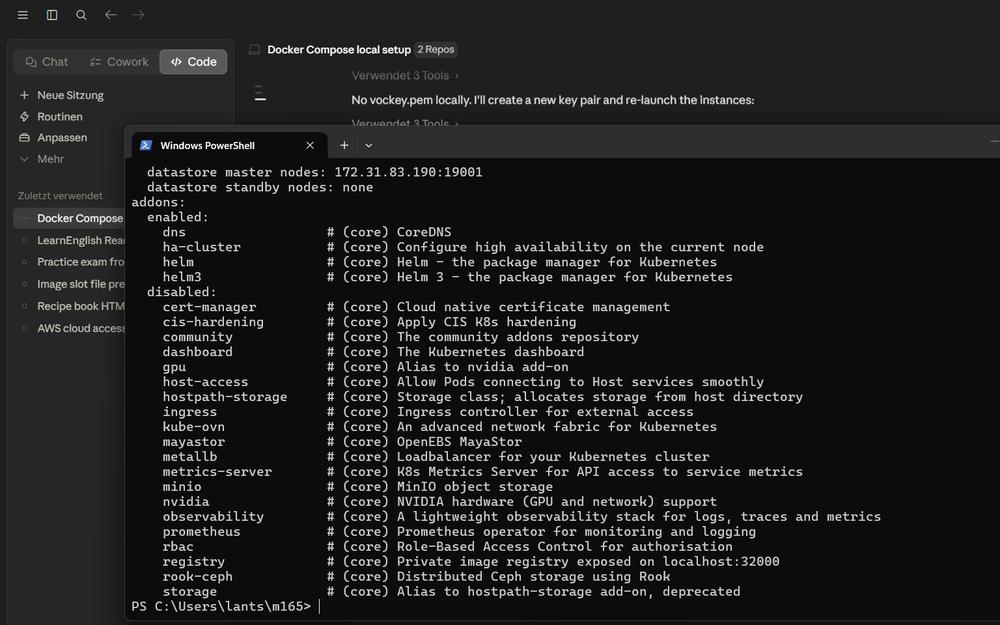
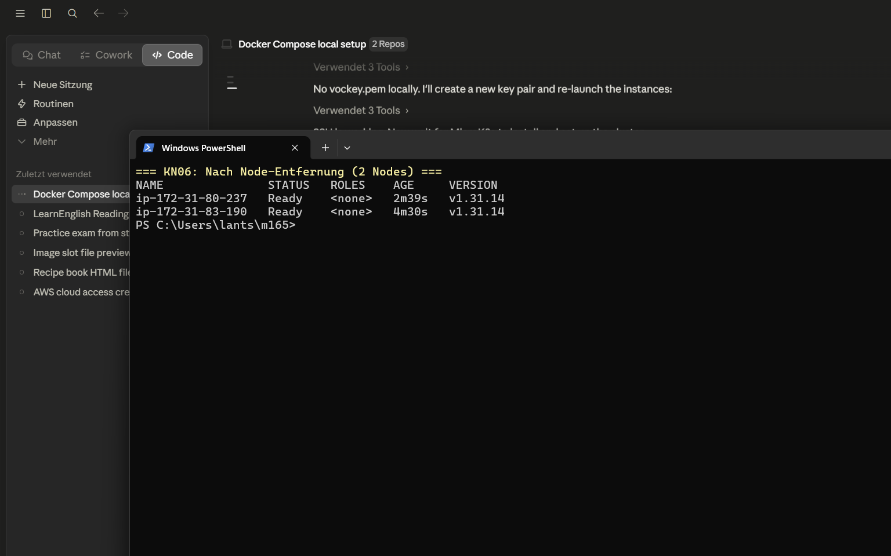
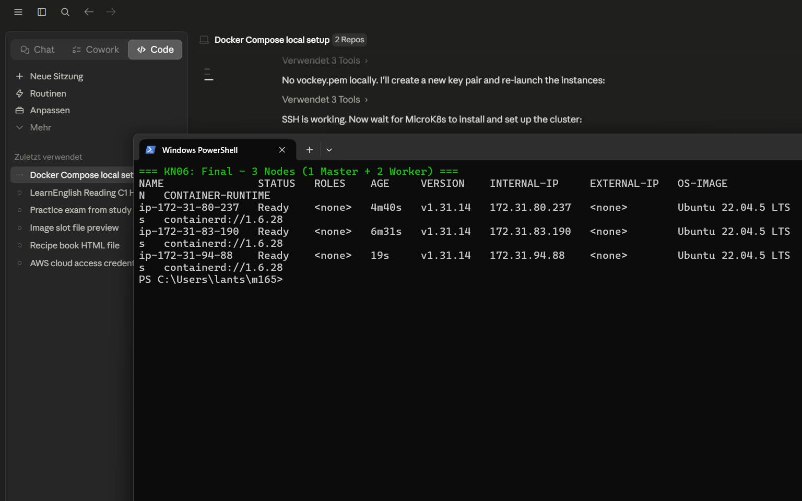
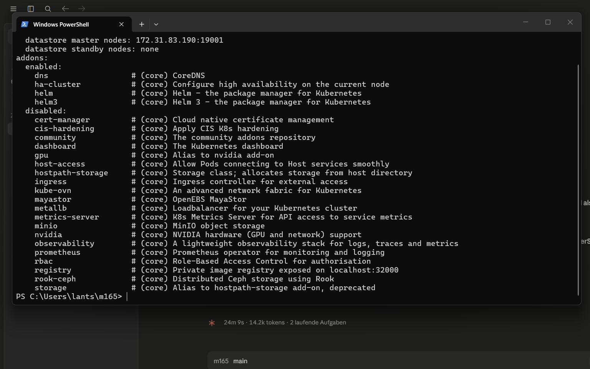

# KN06: Kubernetes

## Inhaltsverzeichnis
- [Cluster-Aufbau](#cluster-aufbau)
- [Node-Übersicht](#node-übersicht)
- [MicroK8s Status](#microk8s-status)
- [Node entfernen und wieder hinzufügen](#node-entfernen-und-wieder-hinzufügen)

---

## Cluster-Aufbau

Drei AWS EC2-Instanzen (Ubuntu 22.04, t3.medium) wurden in `us-east-1` erstellt und zu einem MicroK8s-Cluster zusammengeschlossen:

| Rolle   | Hostname            | Private IP      | Public IP       |
|---------|---------------------|-----------------|-----------------|
| Master  | ip-172-31-83-190    | 172.31.83.190   | 54.173.90.48    |
| Worker1 | ip-172-31-80-237    | 172.31.80.237   | 32.197.249.229  |
| Worker2 | ip-172-31-94-88     | 172.31.94.88    | 3.95.229.114    |

### Installation und Cluster-Join

```bash
# MicroK8s auf allen Nodes installieren
sudo snap install microk8s --classic --channel=1.31/stable
sudo usermod -aG microk8s ubuntu

# Auf Master: Join-Token generieren
microk8s add-node

# Auf Worker-Node: Cluster beitreten (als Worker)
microk8s join <master-ip>:25000/<token> --worker
```

---

## Node-Übersicht

### `microk8s kubectl get nodes` (vom Master)



```
NAME               STATUS   ROLES    AGE     VERSION    INTERNAL-IP
ip-172-31-80-237   Ready    <none>   51s     v1.31.14   172.31.80.237
ip-172-31-83-190   Ready    <none>   2m42s   v1.31.14   172.31.83.190
ip-172-31-94-88    Ready    <none>   34s     v1.31.14   172.31.94.88
```

Alle drei Nodes sind im Status `Ready`.

---

## MicroK8s Status

### `microk8s status` (vom Master)



```
microk8s is running
high-availability: no
  datastore master nodes: 172.31.83.190:19001
  datastore standby nodes: none
addons:
  enabled:
    dns
    ha-cluster
    helm
    helm3
```

---

## Node entfernen und wieder hinzufügen

### Schritt 1: Worker2 aus dem Cluster entfernen

```bash
# Auf Master: Node entfernen
microk8s remove-node ip-172-31-94-88 --force
```

### `kubectl get nodes` nach Entfernung (nur 2 Nodes)



```
NAME               STATUS   ROLES    AGE
ip-172-31-80-237   Ready    <none>   ...
ip-172-31-83-190   Ready    <none>   ...
```

Worker2 (`ip-172-31-94-88`) ist entfernt — nur noch Master + 1 Worker.

### Schritt 2: Worker2 als Worker wieder hinzufügen

```bash
# Auf Master: Neues Join-Token generieren
microk8s add-node

# Auf Worker2: Cluster wieder beitreten (explizit als --worker)
microk8s join 172.31.83.190:25000/<neuer-token> --worker
```

### `kubectl get nodes` nach Wiederaufnahme (3 Nodes)



```
NAME               STATUS   ROLES    AGE     VERSION
ip-172-31-80-237   Ready    <none>   5m10s   v1.31.14
ip-172-31-83-190   Ready    <none>   7m1s    v1.31.14
ip-172-31-94-88    Ready    <none>   49s     v1.31.14
```

### Status nach Wiederaufnahme



Alle drei Nodes sind wieder `Ready`. Worker2 wurde erfolgreich als `--worker` (ohne Control-Plane-Rechte) wieder aufgenommen.

> **Unterschied Master vs. Worker:** Der Master-Node (`ip-172-31-83-190`) hostet den Datastore (`172.31.83.190:19001`) und steuert den Cluster. Die Worker-Nodes führen Pods aus, haben aber keinen Zugriff auf die Cluster-Verwaltung.
