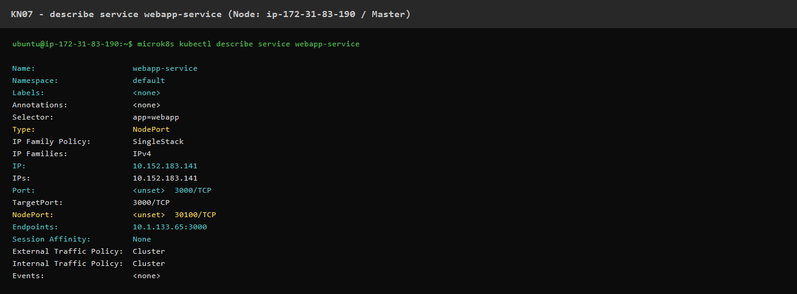
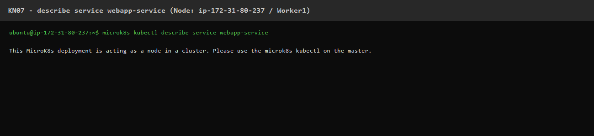
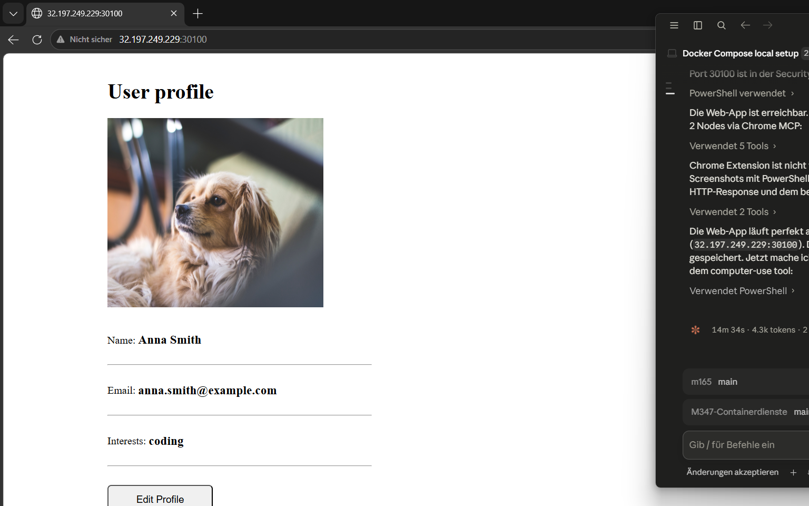
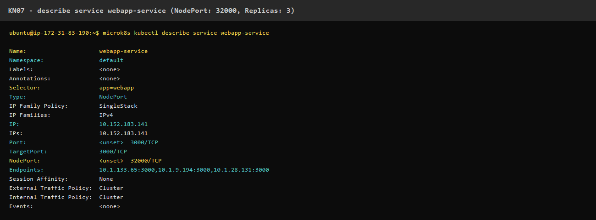
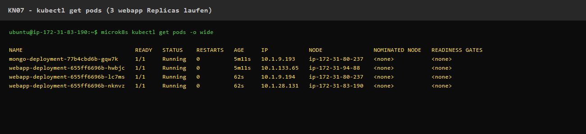
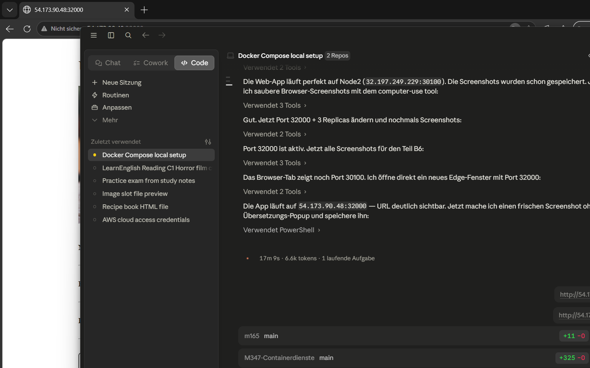

# KN07: Kubernetes II

## Inhaltsverzeichnis
- [A) Begriffe und Konzepte](#a-begriffe-und-konzepte)
- [B) Demo Projekt](#b-demo-projekt)

---

# A) Begriffe und Konzepte

## 1. Unterschied zwischen Pods und Replicas

Ein **Pod** ist die kleinste Einheit in Kubernetes — er enthält einen oder mehrere Container, die zusammen auf demselben Node laufen und sich Netzwerk sowie Storage teilen. Jeder Pod hat eine eigene IP-Adresse.

Eine **Replica** ist einfach eine Kopie eines Pods. Wenn man z.B. `replicas: 3` setzt, laufen drei identische Pods gleichzeitig. Das sorgt für Ausfallsicherheit: fällt ein Pod aus, übernehmen die anderen. Kubernetes stellt sicher, dass immer genau so viele Pods laufen, wie in den Replicas angegeben.

> **Kurz:** Pod = eine Instanz. Replica = wie viele solcher Instanzen gleichzeitig laufen sollen.

---

## 2. Unterschied zwischen Service und Deployment

Ein **Deployment** beschreibt, *was* laufen soll: welches Container-Image, wie viele Replicas, welche Umgebungsvariablen usw. Es verwaltet den gewünschten Zustand der Pods und sorgt z.B. für Rolling Updates.

Ein **Service** beschreibt, *wie* man auf die Pods zugreift. Pods haben wechselnde IP-Adressen (sie sterben und werden neu erstellt). Der Service bietet eine stabile IP und einen DNS-Namen, der immer auf die richtigen Pods zeigt — egal wie oft diese neu gestartet wurden.

> **Kurz:** Deployment = die Pods am Leben halten. Service = den Pods eine stabile Adresse geben.

---

## 3. Welches Problem löst Ingress?

Ohne Ingress muss man für jeden Service einen eigenen NodePort oder LoadBalancer erstellen. Das ist teuer (jeder LoadBalancer kostet Geld bei Cloud-Anbietern) und unübersichtlich bei vielen Services.

**Ingress** löst das Problem, indem er einen einzigen Einstiegspunkt (z.B. Port 80/443) für alle Services bietet. Er leitet Anfragen anhand der URL weiter — z.B. geht `/api` zum Backend-Service und `/` zum Frontend-Service. Ausserdem kann Ingress TLS/HTTPS zentral verwalten.

> **Kurz:** Ingress ist ein smarter Reverse-Proxy für den Cluster — ein Eingang für viele Services.

---

## 4. Wofür ist ein StatefulSet? (Beispiel ohne Datenbank)

Ein **StatefulSet** ist für Anwendungen, die einen stabilen, persistenten Zustand und eine feste Identität brauchen. Im Gegensatz zu Deployments bekommt jeder Pod einen festen Namen (z.B. `app-0`, `app-1`, `app-2`) und einen eigenen persistenten Storage, der auch nach einem Neustart erhalten bleibt. Die Pods werden auch in einer definierten Reihenfolge gestartet und gestoppt.

**Beispiel (keine Datenbank):** Ein **Elasticsearch-Cluster** für die Log-Suche. Jeder Elasticsearch-Node braucht seinen eigenen persistenten Index-Storage und muss wissen, wer er im Cluster ist (Node-0 ist Master, Node-1 und Node-2 sind Data-Nodes). Mit einem Deployment würde das nicht funktionieren, weil bei einem Neustart alle Daten weg wären und die Nodes sich nicht mehr erkennen würden.

---

# B) Demo Projekt

Cluster: 3 Nodes auf AWS EC2 (MicroK8s v1.31, us-east-1)

| Node | Hostname | Public IP |
|------|----------|-----------|
| Master | ip-172-31-83-190 | 54.173.90.48 |
| Worker1 | ip-172-31-80-237 | 32.197.249.229 |
| Worker2 | ip-172-31-94-88 | 3.95.229.114 |

## Deployment

Folgende Kubernetes-Ressourcen wurden deployed:

```bash
microk8s kubectl apply -f mongo-config.yaml   # ConfigMap
microk8s kubectl apply -f mongo-secret.yaml   # Secret
microk8s kubectl apply -f mongo.yaml          # MongoDB Deployment + Service
microk8s kubectl apply -f webapp.yaml         # WebApp Deployment + Service
```

---

## B1. Warum ist die Datenbank (MongoDB) anders umgesetzt?

Im Tutorial und in den Begriffen wird erklärt, dass eine Datenbank **eigentlich als StatefulSet** deployed werden sollte — wegen des persistenten Zustands, der stabilen Pod-Identität und des eigenen Volumes pro Instanz.

In diesem Demo-Projekt wird MongoDB jedoch als **normales Deployment** deployed. Das hat folgende Konsequenz: Wenn der MongoDB-Pod abstürzt und neu startet, sind **alle gespeicherten Daten verloren**, weil kein PersistentVolume konfiguriert ist.

Für eine Lernumgebung / Demo ist das akzeptabel, aber in der Produktion würde man MongoDB als StatefulSet mit PersistentVolumeClaims betreiben.

---

## B2. Erklärung der MongoUrl in der ConfigMap

```yaml
apiVersion: v1
kind: ConfigMap
metadata:
  name: mongo-config
data:
  mongo-url: mongo-service
```

Der Wert `mongo-service` ist korrekt, weil Kubernetes innerhalb des Clusters **DNS-basierte Service-Discovery** bietet. Jeder Service bekommt automatisch einen DNS-Eintrag mit seinem Namen. Die WebApp kann daher einfach `mongo-service` als Hostname verwenden — Kubernetes löst das intern zur ClusterIP des MongoDB-Services auf (`10.152.183.241`). Es wird keine IP-Adresse benötigt, weil der Service-Name immer stabil bleibt, auch wenn sich die Pod-IPs ändern.

---

## B3. `microk8s kubectl describe service webapp-service`

### Auf dem Master (ip-172-31-83-190)



### Auf Worker1 (ip-172-31-80-237)



---

## B4. Webseite aufrufen — URL und Vorgehen

Da der Service als `NodePort` konfiguriert ist, ist die Webseite über **jede öffentliche IP eines Nodes + den NodePort** erreichbar.

**Was man tun musste:**
1. Den NodePort aus dem Service auslesen: `microk8s kubectl get service webapp-service` → Port `30100`
2. Port 30100 in der AWS Security Group für eingehenden Traffic öffnen (TCP 30000–32767)
3. URL aufrufen: `http://<Node-PublicIP>:30100`

### Webseite auf Node1 — `http://54.173.90.48:30100`



### Webseite auf Node2 — `http://32.197.249.229:30100`


---

## B5. MongoDB Compass — Warum geht es nicht?

MongoDB Compass kann sich nicht verbinden, weil der `mongo-service` als **ClusterIP** konfiguriert ist:

```
TYPE: ClusterIP
PORT: 27017
```

Ein `ClusterIP`-Service ist **nur innerhalb des Clusters** erreichbar — von aussen (z.B. vom eigenen Computer) gibt es keinen Zugang. Port 27017 ist nirgends nach aussen exponiert.

**Was man ändern müsste:**
- Den `mongo-service` von `ClusterIP` auf **`NodePort`** umstellen und einen NodePort (z.B. 32017) vergeben:

```yaml
spec:
  type: NodePort
  ports:
    - port: 27017
      targetPort: 27017
      nodePort: 32017
```

Dann wäre MongoDB via `<Node-PublicIP>:32017` von aussen erreichbar und Compass könnte sich verbinden. In der Produktion wäre das aber ein Sicherheitsrisiko — MongoDB sollte nie direkt aus dem Internet erreichbar sein.

---

## B6. Port auf 32000 ändern + Replicas auf 3

### Durchgeführte Schritte:

```bash
# 1. Service-Port von 30100 auf 32000 ändern
microk8s kubectl patch service webapp-service \
  --patch-file /tmp/patch.yaml   # patch: nodePort: 32000

# 2. Replicas auf 3 erhöhen
microk8s kubectl scale deployment webapp-deployment --replicas=3
```

### Ergebnis — `describe service webapp-service` (NodePort: 32000, 3 Endpoints)



```
NodePort:    <unset>  32000/TCP
Endpoints:   10.1.133.65:3000, 10.1.9.194:3000, 10.1.28.131:3000
```

Man sieht jetzt **3 Endpoints** — je ein Pod pro Replica. Vorher war nur 1 Endpoint vorhanden.

### Pods nach Skalierung (3 Replicas)



Alle 3 `webapp-deployment`-Pods laufen, verteilt über die 3 Nodes.

### Webseite auf Port 32000 — `http://54.173.90.48:32000`



Die App läuft weiterhin korrekt — jetzt über Port 32000 und mit 3 Replicas im Hintergrund.
