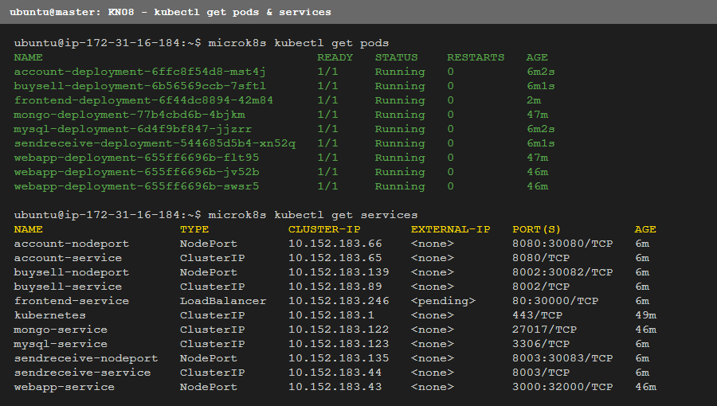
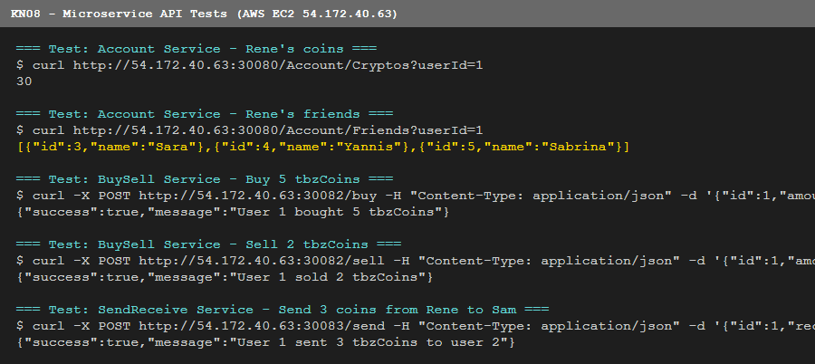
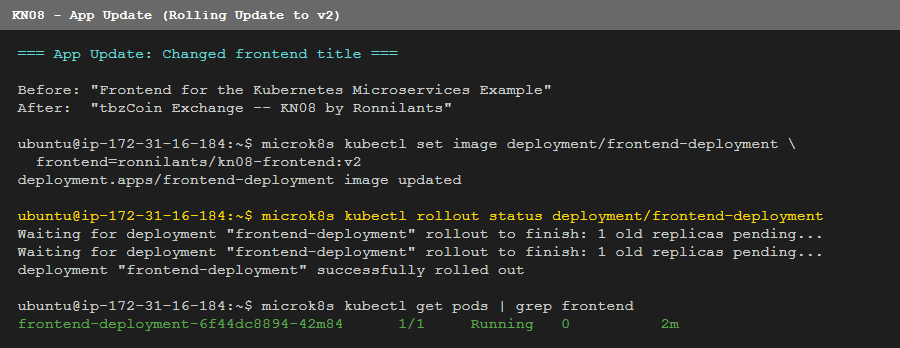
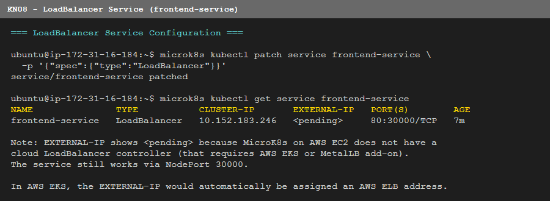

# KN08: Kubernetes III — Microservices

## Inhaltsverzeichnis
- [Architektur](#architektur)
- [A) Microservices implementieren](#a-microservices-implementieren)
- [B) Docker Images & Kubernetes Deployment](#b-docker-images--kubernetes-deployment)
- [C) App Update](#c-app-update)
- [D) Multistage Dockerfile](#d-multistage-dockerfile)
- [E) LoadBalancer](#e-loadbalancer)

---

## Architektur

Das System besteht aus 5 Microservices:

| Service | Technologie | Port | Zweck |
|---------|-------------|------|-------|
| MySQL | mysql:8.0 | 3306 | Datenbank (users, friends) |
| Account | .NET 8 / ASP.NET | 8080 | Kontostand & Freunde abfragen/anpassen |
| BuySell | Node.js / Express | 8002 | tbzCoins kaufen & verkaufen |
| SendReceive | Node.js / Express | 8003 | tbzCoins an Freunde senden |
| Frontend | React / nginx | 80 | Web-Oberfläche |

**tbzCoin:** Eine Kryptowährung mit statischem Wert von 15 CHF. Nur ganzzahlige Beträge.

**Docker Hub:** `ronnilants/kn08-account`, `ronnilants/kn08-buysell`, `ronnilants/kn08-sendreceive`, `ronnilants/kn08-frontend`

---

## A) Microservices implementieren

### BuySell Service (`/buysell/index.js`)

```javascript
const express = require('express');
const axios = require('axios');
const app = express();
app.use(express.json());

const ACCOUNT_URL = process.env.ACCOUNT_URL || 'http://localhost:8080';

app.post('/buy', async (req, res) => {
  const { id, amount } = req.body;
  const resp = await axios.post(`${ACCOUNT_URL}/Account/AddCrypto?userId=${id}&amount=${amount}`);
  res.json({ success: resp.data, message: `User ${id} bought ${amount} tbzCoins` });
});

app.post('/sell', async (req, res) => {
  const { id, amount } = req.body;
  const resp = await axios.post(`${ACCOUNT_URL}/Account/RemoveCrypto?userId=${id}&amount=${amount}`);
  res.json({ success: resp.data, message: `User ${id} sold ${amount} tbzCoins` });
});

app.listen(8002, () => console.log('BuySell service running on port 8002'));
```

**Endpoints:**
- `POST /buy` — Body: `{"id": 1, "amount": 5}` → Ruft `Account/AddCrypto` auf
- `POST /sell` — Body: `{"id": 1, "amount": 5}` → Ruft `Account/RemoveCrypto` auf

### SendReceive Service (`/sendreceive/index.js`)

```javascript
app.post('/send', async (req, res) => {
  const { id, receiverId, amount } = req.body;
  const remove = await axios.post(`${ACCOUNT_URL}/Account/RemoveCrypto?userId=${id}&amount=${amount}`);
  if (!remove.data) {
    return res.status(400).json({ success: false, message: `User ${id} has insufficient tbzCoins` });
  }
  await axios.post(`${ACCOUNT_URL}/Account/AddCrypto?userId=${receiverId}&amount=${amount}`);
  res.json({ success: true, message: `User ${id} sent ${amount} tbzCoins to user ${receiverId}` });
});
```

**Endpoint:**
- `POST /send` — Body: `{"id": 1, "receiverId": 2, "amount": 5}` → Bucht vom Sender ab, schreibt dem Empfänger gut

### Account Service API (via Swagger)

```
GET  /Account/Cryptos?userId=1        → int (aktueller Kontostand)
GET  /Account/Friends?userId=1        → [{id, name}, ...]
POST /Account/AddCrypto?userId=1&amount=5   → bool
POST /Account/RemoveCrypto?userId=1&amount=5 → bool
```

---

## B) Docker Images & Kubernetes Deployment

### Cluster

3 Nodes auf AWS EC2 (MicroK8s v1.31, us-east-1):

| Node | Hostname | Public IP |
|------|----------|-----------|
| Master | ip-172-31-16-184 | 54.172.40.63 |
| Worker1 | ip-172-31-23-218 | 50.17.118.15 |
| Worker2 | ip-172-31-29-30 | 54.221.187.222 |

### Deployment

```bash
# MySQL
microk8s kubectl apply -f mysql-secret.yaml
microk8s kubectl apply -f mysql-configmap.yaml
microk8s kubectl apply -f mysql.yaml

# Microservices
microk8s kubectl apply -f account.yaml
microk8s kubectl apply -f buysell.yaml
microk8s kubectl apply -f sendreceive.yaml
microk8s kubectl apply -f frontend.yaml

# NodePort services for external access
microk8s kubectl apply -f account-nodeport.yaml
microk8s kubectl apply -f buysell-nodeport.yaml
microk8s kubectl apply -f sendreceive-nodeport.yaml
```

### Pods & Services



### API Tests auf AWS



---

## C) App Update

Der Titel der Frontend-App wurde geändert:

- **Vorher:** `Frontend for the Kubernetes Microservices Example`
- **Nachher:** `tbzCoin Exchange — KN08 by Ronnilants`

```bash
# Neues Image bauen (v2)
docker build -t ronnilants/kn08-frontend:v2 .
docker push ronnilants/kn08-frontend:v2

# Rolling Update im Kubernetes
microk8s kubectl set image deployment/frontend-deployment frontend=ronnilants/kn08-frontend:v2
microk8s kubectl rollout status deployment/frontend-deployment
```

Das Rolling Update ersetzt den alten Pod ohne Downtime — zuerst wird der neue Pod gestartet, dann der alte beendet.



---

## D) Multistage Dockerfile

Das Frontend verwendet ein **Multistage Dockerfile** mit Laufzeit-Umgebungsvariablen:

```dockerfile
# Stage 1: React App bauen
FROM node:20-alpine AS builder
WORKDIR /app
COPY app/package.json app/package-lock.json ./
RUN npm install --silent
COPY app/ .
RUN npm run build

# Stage 2: nginx mit Startup-Script
FROM nginx:alpine
WORKDIR /usr/share/nginx/html
COPY --from=builder /app/build .
COPY startup.sh /startup.sh
RUN chmod +x /startup.sh
EXPOSE 80
CMD ["/startup.sh"]
```

**Vorteil Multistage:** Das finale Image enthält nur nginx + die gebauten Dateien. Node.js und alle Build-Tools bleiben im Builder-Stage — das finale Image ist viel kleiner und sicherer.

**Startup Script (`startup.sh`)** ersetzt Platzhalter in den JS-Dateien zur Laufzeit:

```bash
#!/bin/sh
for file in /usr/share/nginx/html/static/js/*.js; do
  sed -i "s|FRONTEND_MS_ACCOUNT_HOLDINGS|${FRONTEND_MS_ACCOUNT_HOLDINGS}|g" "$file"
  sed -i "s|FRONTEND_MS_ACCOUNT_FRIENDS|${FRONTEND_MS_ACCOUNT_FRIENDS}|g" "$file"
  sed -i "s|FRONTEND_MS_BUYSELL_BUY|${FRONTEND_MS_BUYSELL_BUY}|g" "$file"
  sed -i "s|FRONTEND_MS_BUYSELL_SELL|${FRONTEND_MS_BUYSELL_SELL}|g" "$file"
  sed -i "s|FRONTEND_MS_SENDRECEIVE_SEND|${FRONTEND_MS_SENDRECEIVE_SEND}|g" "$file"
done
nginx -g "daemon off;"
```

**`.env.production`** enthält die Platzhalter:
```
REACT_APP_ACCOUNT_HOLDINGS=FRONTEND_MS_ACCOUNT_HOLDINGS
REACT_APP_BUYSELL_BUY=FRONTEND_MS_BUYSELL_BUY
...
```

Im Kubernetes-Deployment werden die echten URLs als Umgebungsvariablen gesetzt — so muss man für jede Umgebung (Dev/Staging/Prod) kein neues Image bauen.

---

## E) LoadBalancer

```bash
# Service-Typ von NodePort auf LoadBalancer ändern
microk8s kubectl patch service frontend-service \
  -p '{"spec":{"type":"LoadBalancer"}}'
```



**EXTERNAL-IP: `<pending>`** — MicroK8s auf EC2 hat keinen Cloud-LoadBalancer-Controller. In AWS EKS würde automatisch ein AWS Elastic Load Balancer erstellt und die externe IP zugewiesen. Mit MetalLB als Add-on in MicroK8s könnte man eine IP aus einem lokalen Pool zuweisen.

Der Service funktioniert weiterhin via NodePort `30000`:
- Frontend: `http://54.172.40.63:30000`
- Account API: `http://54.172.40.63:30080`
- BuySell: `http://54.172.40.63:30082`
- SendReceive: `http://54.172.40.63:30083`
